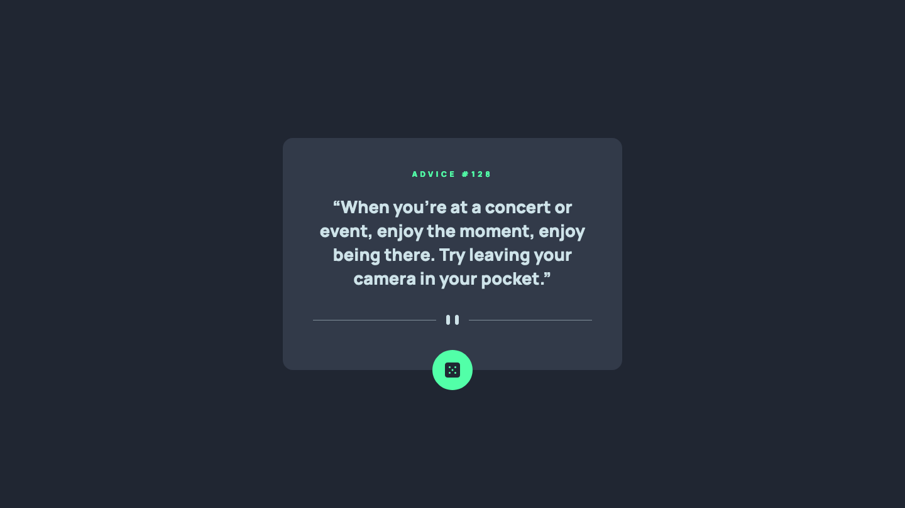

# Frontend Mentor - Advice Generator App Solution

This is a solution to the [Advice Generator App Challenge on Frontend Mentor](https://www.frontendmentor.io/challenges/advice-generator-app-QdUG-13db). Frontend Mentor challenges help you improve your coding skills by building realistic projects.

## Screenshot

## Built with

- Semantic HTML5 markup
- CSS custom properties
- Mobile-first workflow
- JavaScript
- API

## What I learned

I had a bit of a break from Frontend Mentor challenges so this was a fairly easy project to get me back into the swing of things. I don't think I learned anything completely new but I did remind myself about a few things, such as how to generate a random number, which I used to grab random quotes based on the ID numbers. I'm getting the hang of using APIs in general and using `fetch` and the `async` and `await` keywords. I'm also fairly pleased with the animations when the button is clicked, however I would also have liked to animate the width and height of the card as it changes size, but I didn't figure out an easy solution.

## Continued development

My CSS is strong but my JavaScript could do with a lot of improvement, so I will try and build projects that develop my JS skills further.